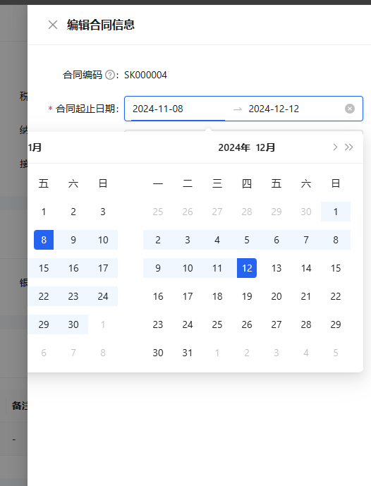

## 场景

当组件 ProFormDateRangePicker 在组件 DrawerForm 中使用时，可能出现组件 ProFormDateRangePicker 显示不全的问题



## 解决方案

在 ProFormDateRangePicker 组件上设置

```jsx
fieldProps={{
  getPopupContainer: () => {
    return document.body;
  },
}}
```

即可不遮挡。
