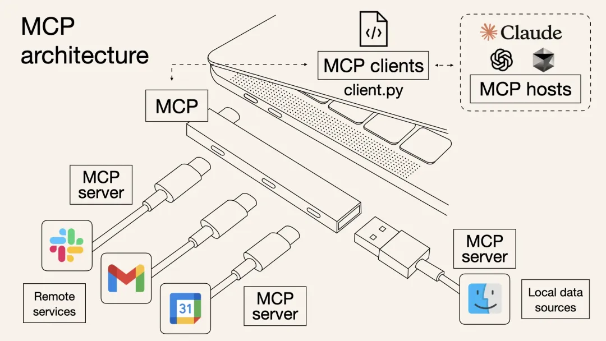
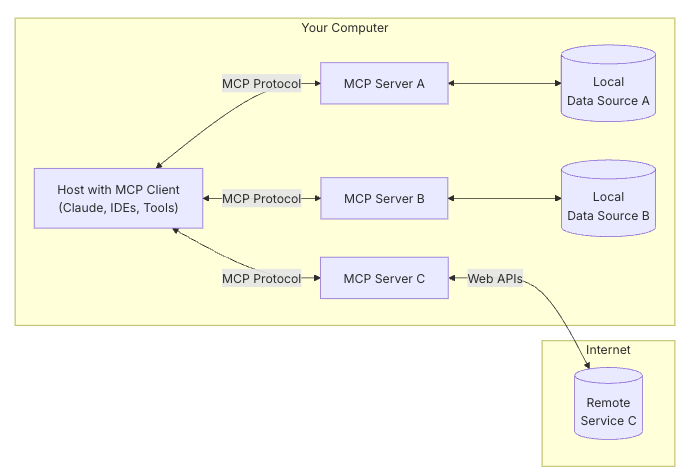
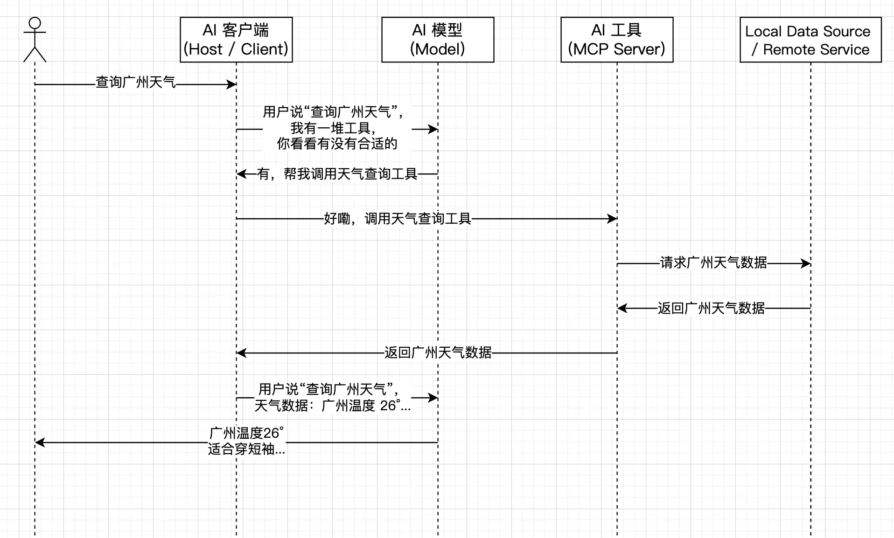

## 概念

MCP(Model Context Protocol 模型上下文协议)，由 Anthropic 退出的开源通信协议，旨在为不同的大型语言模型( LLM )与外部数据源和工具通过统一的接口进行协作，用来在大模型和数据源之间简历安全双向的链接。目标是成为 AI 领域的“HTTP 协议”，推动 LLM 应用的标准化和去中心化。

类似于 Type-C 扩展坞，视频、耳机、USB 等接口集中在一个扩展坞中，最后却可以通过一个 Type-C 接口接入电脑。

## MCP 主要架构

MCP 采用客户端-服务器架构，主要包含以下几个组件：

- MCP 主机(Host) / 客户端(Client): 如 Claude Desktop、IDE 或其他 AI 工具， 与服务器保持 1:1 的连接的协议客户端，向 MCP 服务器发起请求，传递用户指令与上下文信息，例如查询天气。
- MCP 服务器(Server): 连接本地文件、数据库(如 MySQL)或远程 API(如 Github)，轻量级程序，通过 OAuth 2.0 等机制管理数据访问权限，将不同的数据源格式统一为 MCP 标准化结构，通过标准化的 MCP 协议公开特定功能。
- 本地数据源(Local Data Source) / 远程服务(Remote Service)：计算机上的文件、数据库和服务或是通过互联网可用的外部系统。

流程大致如下：

例子：

